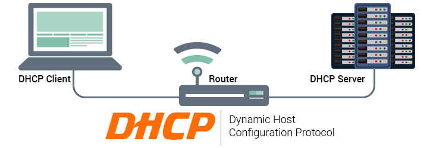

# Qt DHCP Server Discovery (Qt4+/Qt5+)
   
 
## What is it

This library (with a basic example) is designed to check if a DHCP server is launched in a provided ip interface.

This class should work with any Qt4 and Qt5 version but was fully tested with <a href="https://download.qt.io/archive/qt/5.13/5.13.0/">Qt 5.13.0</a> and <a href="https://download.qt.io/archive/qt/4.8/4.8.7/">Qt 4.8.7</a> (only required libraries: QtNetwork and QtCore)

## How to install

1) Download <a target="_blank" href="https://github.com/QuentinCG/QDhcpDiscovery/releases/download/1.0.0/QDhcpDiscovery_v1_0_0.zip">latest release</a> (and launch the exe file if you don't want to compile it)

2) Open the <a href="https://github.com/QuentinCG/QDhcpDiscovery/blob/master/QDhcpDiscovery.pro">QDhcpDiscovery.pro</a> project with <a href="https://download.qt.io/archive/qt/">QtCreator</a> (or add the <a href="https://github.com/QuentinCG/QDhcpDiscovery/blob/master/include/QDhcpDiscovery.h">QDhcpDiscovery.h</a> and <a href="https://github.com/QuentinCG/QDhcpDiscovery/blob/master/src/QDhcpDiscovery.cpp">QDhcpDiscovery.cpp</a> files into your project and add `QT += core` and `QT += network` in your pro file)

4) Build and launch the project to see the result in the command line (example: `QDhcpDiscovery.exe 127.0.0.1`)

## License

This project is under MIT license. This means you can use it as you want (just don't delete the library header).

## Contribute

If you want to add more examples or improve the library, just create a pull request with proper commit message and right wrapping.
